# SecureBank

SecureBank is a **Flask-based** web application that demonstrates modern security practices for an online banking platform. It provides user registration, two-factor authentication (TOTP), encrypted credit-card storage, role-based access control, and a responsive Bootstrap 5 interface with light/dark themes.

---

## 🚀 Overview

The project follows Flask’s **Application Factory** pattern and a modular blueprint structure (`auth`, `bank`, `admin`).  
It combines a production-ready backend (SQLAlchemy, Flask-Login, Flask-Limiter, Flask-Talisman) with a polished UI to showcase how to build, secure, and deploy a small-scale banking site.

---

## 🛠 Tech Stack

| Layer            | Technology                                                                                       |
|------------------|--------------------------------------------------------------------------------------------------|
| **Language**     | Python                                                                                           |
| **Framework**    | Flask                                                                                            |
| **Database**     | SQLite , SQLAlchemy                                                                              |
| **Auth**         | Flask-Login · TOTP (pyotp)                                                                       |
| **Forms / CSRF** | WTForms · Flask-WTF                                                                              |
| **Security**     | Flask-Talisman (CSP & HSTS) · Flask-Limiter (rate limiting) · bcrypt hashing · Fernet encryption |
| **Migrations**   | Flask-Migrate / Alembic                                                                          | |
| **Frontend**     | Bootstrap 5.3 · custom CSS & JS (theme toggle)                                                   |

---

## 🎯 Features

| Category             | Highlights                                                                                                    |
|----------------------|---------------------------------------------------------------------------------------------------------------|
| **Account Management** | Sign-up, login, logout                                                    |
| **Two-Factor Auth**  | TOTP QR provisioning for Google Authenticator; enforced for non-admin users                                   |
| **Banking Actions**  | Deposit, withdraw, peer-to-peer transfer, paginated transaction history                                       |
| **Card Handling**    | Credit-card numbers encrypted at rest with Fernet; only last 4 digits shown                                   |
| **Admin Panel**      | View all users, balances, and download each user’s TOTP QR                                                    |
| **Security Hardening** | Secure cookies, HTTPS redirects, strict Content-Security-Policy, brute-force rate limits                    |
| **Logging**          | Rotating `logs/audit.log` with security-relevant events (logins, errors, admin actions)                       |
| **Responsive UI**    | Bootstrap cards, rounded corners, dark-mode toggle stored in `localStorage`                                   |

---

## 🧪 How It Works

1. **Factory Boot-up** – `create_app()` reads `FLASK_ENV` (`development` / `production`) and config classes, initialises extensions, and registers blueprints.  
2. **Registration Flow** – WTForm → bcrypt-hashed password & encrypted card stored → unique **TOTP secret** displayed as a QR.  
3. **Login + TOTP** – Username/password validated; non-admin users must confirm a 6-digit TOTP code.  
4. **Bank Operations** – Authenticated users can **deposit, withdraw, or transfer**; each action records a `Transaction` row and updates balances automatic.  
5. **Admin Area** – Blueprint guard restricts paths to admins; admins list users, view balances, and open QR codes.
6. **Security Layers** – **Flask-Limiter** (5/min registrations, 10/min logins), **Flask-Talisman** (strict CSP + HSTS), **Fernet** encryption for card data.

---

## 📲 Installation

1. **Open the project in Pycharm.**
2. **Open terminal and Write:**
- **pip install -r requirements.txt**
- **python app.py**

---

## 📸 Screenshots

| # | Screen | File                                                                       |
|---|--------|----------------------------------------------------------------------------|
| 1 | 📝 **Sign-Up** | 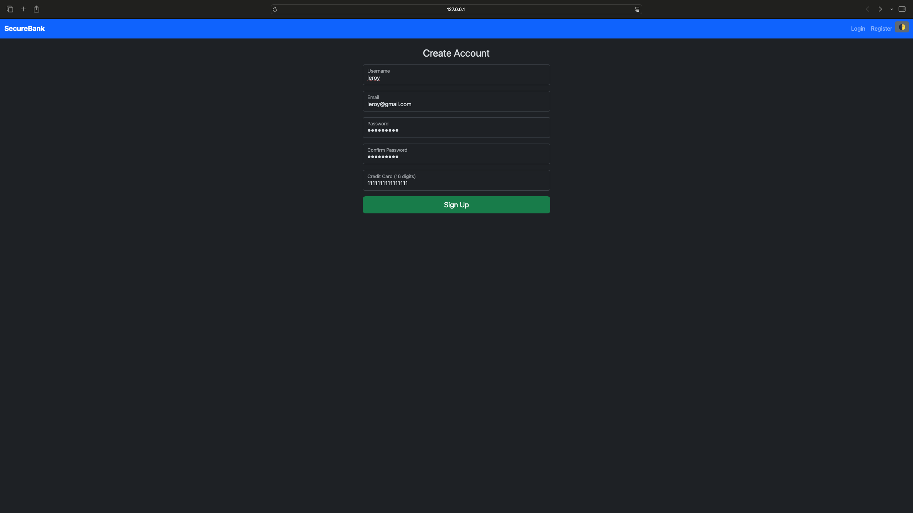                                    |
| 2 | 📱 **QR After Sign-Up** | 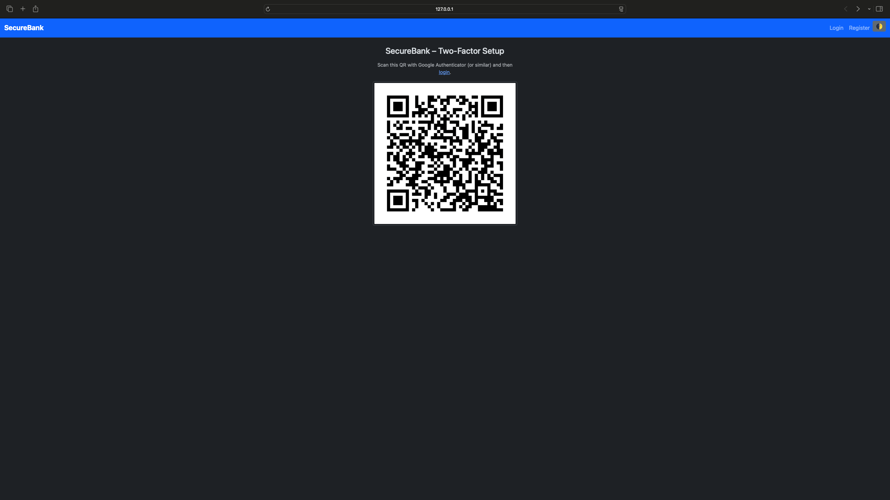                    |
| 3 | 🔐 **Login** | 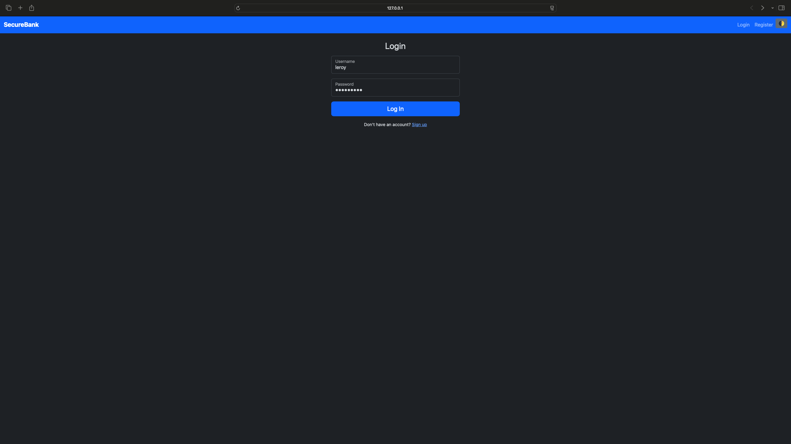                                       |
| 4 | ✅ **6-Digit TOTP Verification** | 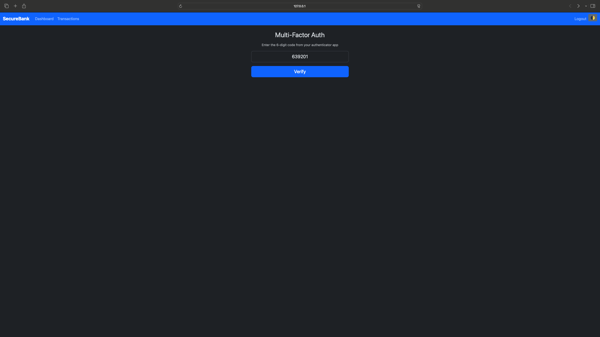        |
| 5 | 🏦 **User Dashboard** |                       |
| 6 | 💸 **Deposit Page** | 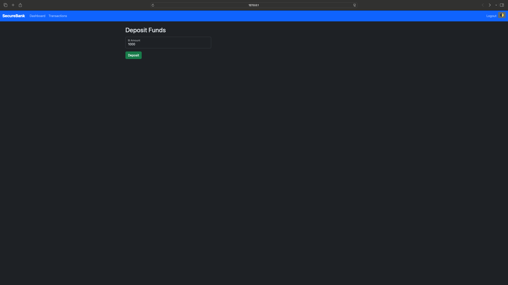                          |
| 7 | 💰 **Withdraw Page** | 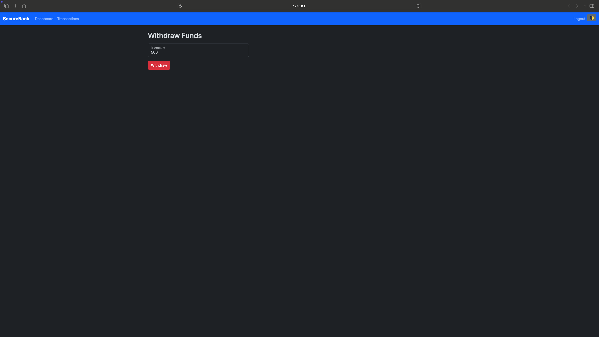                        |
| 8 | 🔄 **Transfer Money Page** | 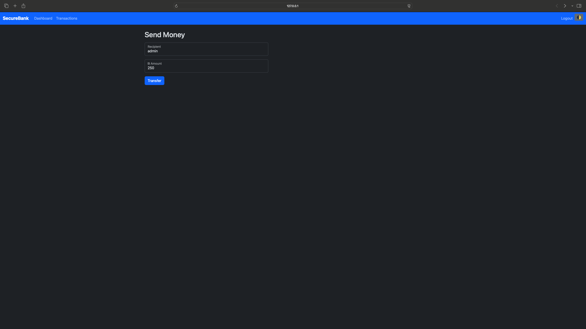             |
| 9 | 📈 **Dashboard After Operations** | 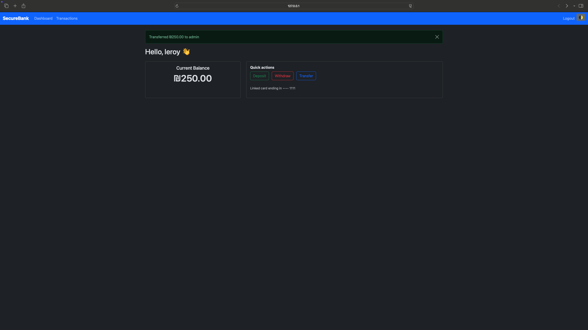 |
|10 | 📜 **Transactions History** |           |
|11 | 🛡 **Admin Dashboard** | 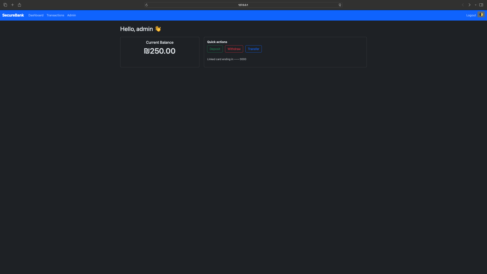                    |
|12 | 📥 **Admin – Received Transfer** | 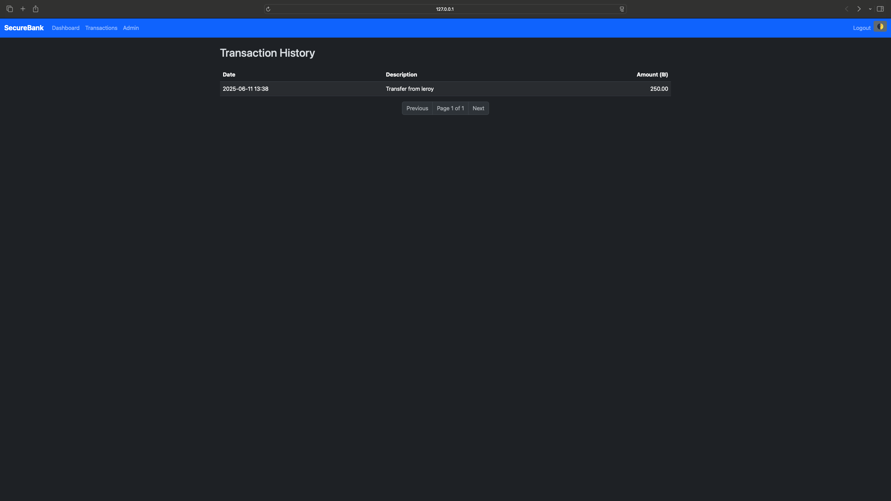   |
|13 | 👥 **Admin – Users List** | 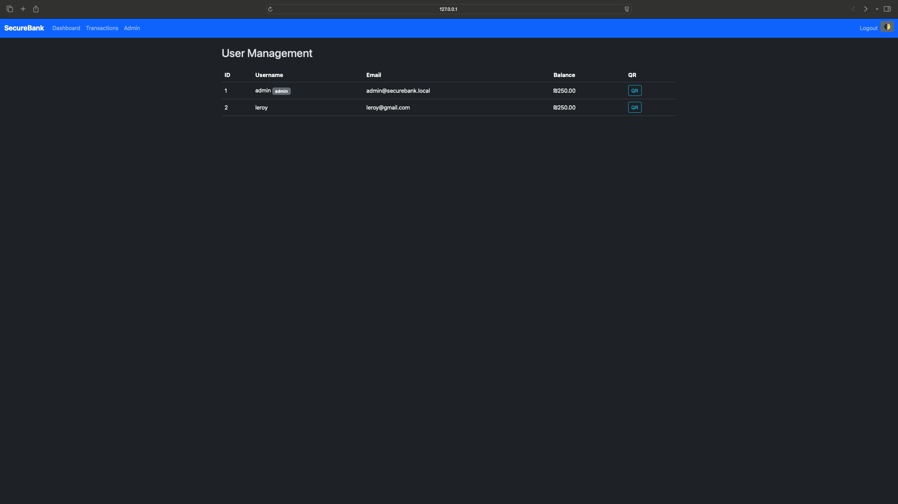                 |

---

## 🙌 Author

Developed by Leroy Fainberg as part of learning Flask and secure web development.